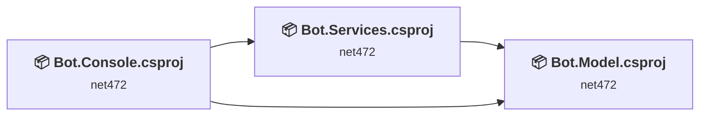
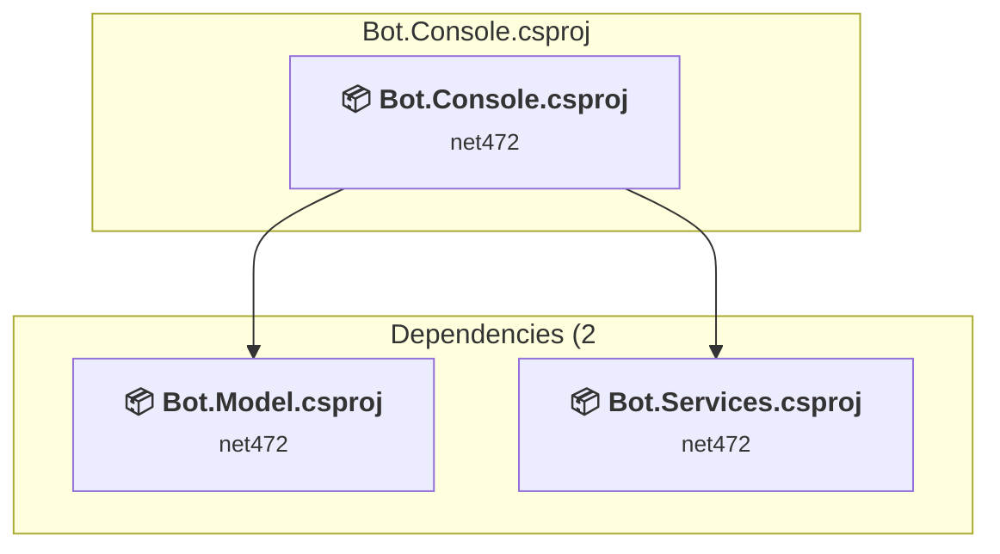
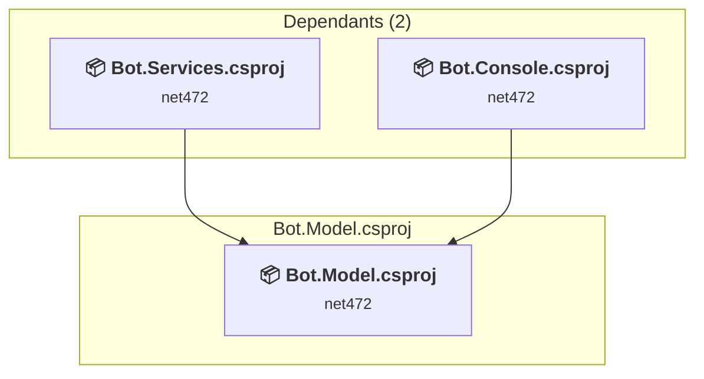
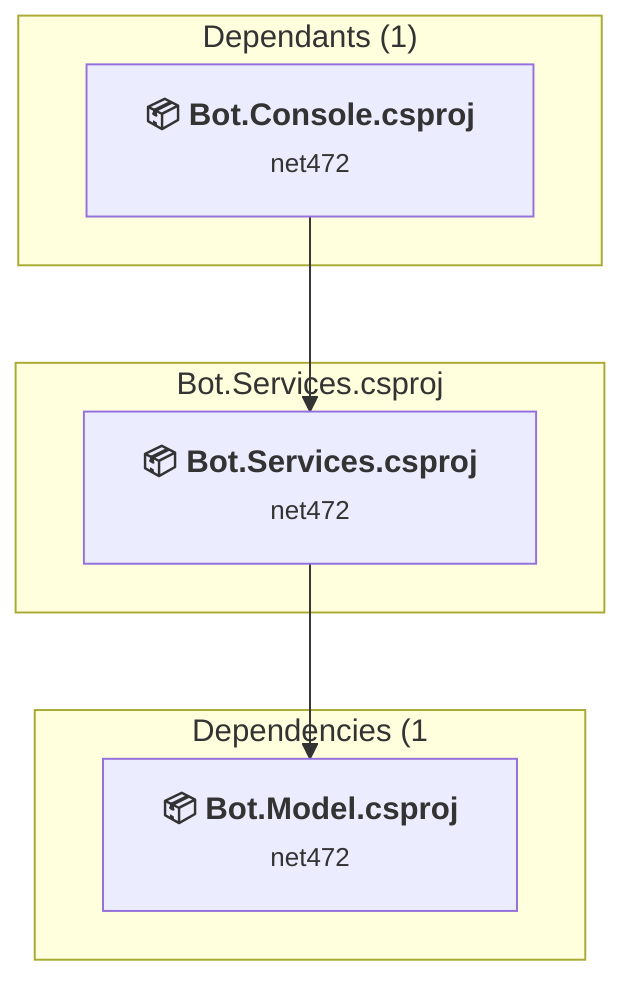

# Projects and dependencies analysis

This document provides a comprehensive overview of the projects and their dependencies in the context of upgrading to .NETCoreApp,Version=v10.0.

## Table of Contents

- [Executive Summary](#executive-Summary)
  - [Highlevel Metrics](#highlevel-metrics)
  - [Projects Compatibility](#projects-compatibility)
  - [Package Compatibility](#package-compatibility)
  - [API Compatibility](#api-compatibility)
- [Aggregate NuGet packages details](#aggregate-nuget-packages-details)
- [Top API Migration Challenges](#top-api-migration-challenges)
  - [Technologies and Features](#technologies-and-features)
  - [Most Frequent API Issues](#most-frequent-api-issues)
- [Projects Relationship Graph](#projects-relationship-graph)
- [Project Details](#project-details)

  - [Bot.Console\Bot.Console.csproj](#botconsolebotconsolecsproj)
  - [Bot.Model\Bot.Model.csproj](#botmodelbotmodelcsproj)
  - [Bot.Services\Bot.Services.csproj](#botservicesbotservicescsproj)

## Executive Summary

### Highlevel Metrics

| Metric | Count | Status |
| :--- | :---: | :--- |
| Total Projects | 3 | All require upgrade |
| Total NuGet Packages | 27 | 17 need upgrade |
| Total Code Files | 55 |  |
| Total Code Files with Incidents | 17 |  |
| Total Lines of Code | 6179 |  |
| Total Number of Issues | 166 |  |
| Estimated LOC to modify | 141+ | at least 2.3% of codebase |

### Projects Compatibility

| Project | Target Framework | Difficulty | Package Issues | API Issues | Est. LOC Impact | Description |
| :--- | :---: | :---: | :---: | :---: | :---: | :--- |
| [Bot.Console\Bot.Console.csproj](#botconsolebotconsolecsproj) | net472 | 🟢 Low | 2 | 0 |  | DotNetCoreApp, Sdk Style = True |
| [Bot.Model\Bot.Model.csproj](#botmodelbotmodelcsproj) | net472 | 🟢 Low | 3 | 0 |  | ClassLibrary, Sdk Style = True |
| [Bot.Services\Bot.Services.csproj](#botservicesbotservicescsproj) | net472 | 🟡 Medium | 17 | 141 | 141+ | ClassLibrary, Sdk Style = True |

### Package Compatibility

| Status | Count | Percentage |
| :--- | :---: | :---: |
| ✅ Compatible | 10 | 37.0% |
| ⚠️ Incompatible | 10 | 37.0% |
| 🔄 Upgrade Recommended | 7 | 25.9% |
| ***Total NuGet Packages*** | ***27*** | ***100%*** |

### API Compatibility

| Category | Count | Impact |
| :--- | :---: | :--- |
| 🔴 Binary Incompatible | 82 | High - Require code changes |
| 🟡 Source Incompatible | 23 | Medium - Needs re-compilation and potential conflicting API error fixing |
| 🔵 Behavioral change | 36 | Low - Behavioral changes that may require testing at runtime |
| ✅ Compatible | 5067 |  |
| ***Total APIs Analyzed*** | ***5208*** |  |

## Aggregate NuGet packages details

| Package | Current Version | Suggested Version | Projects | Description |
| :--- | :---: | :---: | :--- | :--- |
| DotNetEnv | 2.3.0 |  | [Bot.Services.csproj](#botservicesbotservicescsproj) | ✅Compatible |
| Microsoft.ApplicationInsights.TraceListener | 2.20.0 |  | [Bot.Services.csproj](#botservicesbotservicescsproj) | ⚠️NuGet package is deprecated |
| Microsoft.ApplicationInsights.WorkerService | 2.20.0 |  | [Bot.Services.csproj](#botservicesbotservicescsproj) | ⚠️NuGet package is deprecated |
| Microsoft.AspNet.WebApi | 5.2.7 |  | [Bot.Services.csproj](#botservicesbotservicescsproj) | ✅Compatible |
| Microsoft.AspNet.WebApi.Owin | 5.2.7 |  | [Bot.Services.csproj](#botservicesbotservicescsproj) | ⚠️NuGet package is incompatible |
| Microsoft.CSharp | 4.7.0 |  | [Bot.Console.csproj](#botconsolebotconsolecsproj) [Bot.Model.csproj](#botmodelbotmodelcsproj) | ✅Compatible |
| Microsoft.Extensions.Configuration.EnvironmentVariables | 6.0.0 | 10.0.5 | [Bot.Services.csproj](#botservicesbotservicescsproj) | NuGet package upgrade is recommended |
| Microsoft.Extensions.Configuration.Json | 6.0.0 | 10.0.5 | [Bot.Services.csproj](#botservicesbotservicescsproj) | NuGet package upgrade is recommended |
| Microsoft.Extensions.DependencyInjection | 6.0.0 | 10.0.5 | [Bot.Services.csproj](#botservicesbotservicescsproj) | NuGet package upgrade is recommended |
| Microsoft.Extensions.FileProviders.Abstractions | 6.0.0 | 10.0.5 | [Bot.Console.csproj](#botconsolebotconsolecsproj) | NuGet package upgrade is recommended |
| Microsoft.Extensions.Options.ConfigurationExtensions | 6.0.0 | 10.0.5 | [Bot.Services.csproj](#botservicesbotservicescsproj) | NuGet package upgrade is recommended |
| Microsoft.Graph | 4.16.0 |  | [Bot.Model.csproj](#botmodelbotmodelcsproj) [Bot.Services.csproj](#botservicesbotservicescsproj) | ✅Compatible |
| Microsoft.Graph.Communications.Calls | 1.2.0.3742 |  | [Bot.Model.csproj](#botmodelbotmodelcsproj) [Bot.Services.csproj](#botservicesbotservicescsproj) | ✅Compatible |
| Microsoft.Graph.Communications.Calls.Media | 1.2.0.3742 | 1.2.0.15690 | [Bot.Services.csproj](#botservicesbotservicescsproj) | ⚠️NuGet package is incompatible |
| Microsoft.IdentityModel.Clients.ActiveDirectory | 5.2.9 |  | [Bot.Services.csproj](#botservicesbotservicescsproj) | ⚠️NuGet package is deprecated |
| Microsoft.NETCore.Platforms | 6.0.1 |  | [Bot.Services.csproj](#botservicesbotservicescsproj) | NuGet package functionality is included with framework reference |
| Microsoft.Owin.Cors | 4.2.0 |  | [Bot.Services.csproj](#botservicesbotservicescsproj) | ⚠️NuGet package is incompatible |
| Microsoft.Owin.Host.HttpListener | 4.2.0 |  | [Bot.Model.csproj](#botmodelbotmodelcsproj) [Bot.Services.csproj](#botservicesbotservicescsproj) | ⚠️NuGet package is incompatible |
| Microsoft.Owin.Hosting | 4.2.0 |  | [Bot.Services.csproj](#botservicesbotservicescsproj) | ⚠️NuGet package is incompatible |
| Microsoft.Owin.StaticFiles | 4.2.0 |  | [Bot.Services.csproj](#botservicesbotservicescsproj) | ⚠️NuGet package is incompatible |
| Microsoft.Skype.Bots.Media | 1.21.0.241-alpha |  | [Bot.Services.csproj](#botservicesbotservicescsproj) | ⚠️NuGet package is incompatible |
| NAudio | 2.0.1 |  | [Bot.Services.csproj](#botservicesbotservicescsproj) | ✅Compatible |
| Newtonsoft.Json | 13.0.1 | 13.0.4 | [Bot.Model.csproj](#botmodelbotmodelcsproj) [Bot.Services.csproj](#botservicesbotservicescsproj) | NuGet package upgrade is recommended |
| Newtonsoft.Json.Bson | 1.0.2 |  | [Bot.Services.csproj](#botservicesbotservicescsproj) | ✅Compatible |
| SharpZipLib | 1.3.3 |  | [Bot.Services.csproj](#botservicesbotservicescsproj) | ✅Compatible |
| System.Data.DataSetExtensions | 4.5.0 |  | [Bot.Console.csproj](#botconsolebotconsolecsproj) [Bot.Model.csproj](#botmodelbotmodelcsproj) | NuGet package functionality is included with framework reference |
| System.Diagnostics.DiagnosticSource | 6.0.0 | 10.0.5 | [Bot.Services.csproj](#botservicesbotservicescsproj) | NuGet package upgrade is recommended |

## Top API Migration Challenges

### Technologies and Features

| Technology | Issues | Percentage | Migration Path |
| :--- | :---: | :---: | :--- |
| ASP.NET Framework (System.Web) | 76 | 53.9% | Legacy ASP.NET Framework APIs for web applications (System.Web.*) that don't exist in ASP.NET Core due to architectural differences. ASP.NET Core represents a complete redesign of the web framework. Migrate to ASP.NET Core equivalents or consider System.Web.Adapters package for compatibility. |
| IdentityModel & Claims-based Security | 3 | 2.1% | Windows Identity Foundation (WIF), SAML, and claims-based authentication APIs that have been replaced by modern identity libraries. WIF was the original identity framework for .NET Framework. Migrate to Microsoft.IdentityModel.* packages (modern identity stack). |

### Most Frequent API Issues

| API | Count | Percentage | Category |
| :--- | :---: | :---: | :--- |
| T:System.Uri | 20 | 14.2% | Behavioral Change |
| P:System.Web.Http.ApiController.Request | 18 | 12.8% | Binary Incompatible |
| T:System.Net.Http.HttpContent | 13 | 9.2% | Behavioral Change |
| M:System.Web.Http.ApiController.#ctor | 12 | 8.5% | Binary Incompatible |
| T:System.Net.Http.HttpRequestMessageExtensions | 10 | 7.1% | Source Incompatible |
| M:System.Net.Http.HttpRequestMessageExtensions.CreateResponse(System.Net.Http.HttpRequestMessage,System.Net.HttpStatusCode) | 10 | 7.1% | Source Incompatible |
| M:System.Web.Http.RouteAttribute.#ctor(System.String) | 6 | 4.3% | Binary Incompatible |
| T:System.Web.Http.RouteAttribute | 6 | 4.3% | Binary Incompatible |
| M:System.Web.Http.HttpPostAttribute.#ctor | 4 | 2.8% | Binary Incompatible |
| T:System.Web.Http.HttpPostAttribute | 4 | 2.8% | Binary Incompatible |
| T:System.Web.Http.ApiController | 4 | 2.8% | Binary Incompatible |
| M:System.Web.Http.FromBodyAttribute.#ctor | 2 | 1.4% | Binary Incompatible |
| T:System.Web.Http.FromBodyAttribute | 2 | 1.4% | Binary Incompatible |
| M:System.TimeSpan.FromMinutes(System.Double) | 2 | 1.4% | Source Incompatible |
| P:System.Net.Http.HttpRequestMessage.Properties | 1 | 0.7% | Source Incompatible |
| M:System.IdentityModel.Tokens.Jwt.JwtSecurityTokenHandler.ValidateToken(System.String,Microsoft.IdentityModel.Tokens.TokenValidationParameters,Microsoft.IdentityModel.Tokens.SecurityToken@) | 1 | 0.7% | Binary Incompatible |
| T:System.IdentityModel.Tokens.Jwt.JwtSecurityTokenHandler | 1 | 0.7% | Binary Incompatible |
| M:System.IdentityModel.Tokens.Jwt.JwtSecurityTokenHandler.#ctor | 1 | 0.7% | Binary Incompatible |
| M:System.Web.Http.RoutePrefixAttribute.#ctor(System.String) | 1 | 0.7% | Binary Incompatible |
| T:System.Web.Http.RoutePrefixAttribute | 1 | 0.7% | Binary Incompatible |
| M:System.Web.Http.HttpDeleteAttribute.#ctor | 1 | 0.7% | Binary Incompatible |
| T:System.Web.Http.HttpDeleteAttribute | 1 | 0.7% | Binary Incompatible |
| M:System.Web.Http.HttpGetAttribute.#ctor | 1 | 0.7% | Binary Incompatible |
| T:System.Web.Http.HttpGetAttribute | 1 | 0.7% | Binary Incompatible |
| M:System.Uri.#ctor(System.Uri,System.String) | 1 | 0.7% | Behavioral Change |
| P:System.Uri.AbsoluteUri | 1 | 0.7% | Behavioral Change |
| T:Owin.WebApiAppBuilderExtensions | 1 | 0.7% | Binary Incompatible |
| M:Owin.WebApiAppBuilderExtensions.UseWebApi(Owin.IAppBuilder,System.Web.Http.HttpConfiguration) | 1 | 0.7% | Binary Incompatible |
| M:System.Web.Http.HttpConfiguration.EnsureInitialized | 1 | 0.7% | Binary Incompatible |
| T:System.Web.Http.Controllers.ServicesContainer | 1 | 0.7% | Binary Incompatible |
| P:System.Web.Http.HttpConfiguration.Services | 1 | 0.7% | Binary Incompatible |
| M:System.Web.Http.Controllers.ServicesContainer.Add(System.Type,System.Object) | 1 | 0.7% | Binary Incompatible |
| P:System.Web.Http.HttpConfiguration.MessageHandlers | 1 | 0.7% | Binary Incompatible |
| T:System.Web.Http.HttpConfigurationExtensions | 1 | 0.7% | Binary Incompatible |
| M:System.Web.Http.HttpConfigurationExtensions.MapHttpAttributeRoutes(System.Web.Http.HttpConfiguration) | 1 | 0.7% | Binary Incompatible |
| T:System.Web.Http.HttpConfiguration | 1 | 0.7% | Binary Incompatible |
| M:System.Web.Http.HttpConfiguration.#ctor | 1 | 0.7% | Binary Incompatible |
| T:System.Web.Http.ExceptionHandling.ExceptionLoggerContext | 1 | 0.7% | Binary Incompatible |
| P:System.Web.Http.ExceptionHandling.ExceptionLoggerContext.Exception | 1 | 0.7% | Binary Incompatible |
| T:System.Web.Http.ExceptionHandling.IExceptionLogger | 1 | 0.7% | Binary Incompatible |
| M:Microsoft.Extensions.DependencyInjection.OptionsConfigurationServiceCollectionExtensions.Configure''1(Microsoft.Extensions.DependencyInjection.IServiceCollection,Microsoft.Extensions.Configuration.IConfiguration) | 1 | 0.7% | Binary Incompatible |
| M:System.Uri.#ctor(System.String) | 1 | 0.7% | Behavioral Change |

## Projects Relationship Graph

Legend:
📦 SDK-style project
⚙️ Classic project

## Project Details

### Bot.Console\Bot.Console.csproj

#### Project Info

- **Current Target Framework:** net472
- **Proposed Target Framework:** net10.0
- **SDK-style**: True
- **Project Kind:** DotNetCoreApp
- **Dependencies**: 2
- **Dependants**: 0
- **Number of Files**: 3
- **Number of Files with Incidents**: 1
- **Lines of Code**: 116
- **Estimated LOC to modify**: 0+ (at least 0.0% of the project)

#### Dependency Graph

Legend:
📦 SDK-style project
⚙️ Classic project

### API Compatibility

| Category | Count | Impact |
| :--- | :---: | :--- |
| 🔴 Binary Incompatible | 0 | High - Require code changes |
| 🟡 Source Incompatible | 0 | Medium - Needs re-compilation and potential conflicting API error fixing |
| 🔵 Behavioral change | 0 | Low - Behavioral changes that may require testing at runtime |
| ✅ Compatible | 85 |  |
| ***Total APIs Analyzed*** | ***85*** |  |

### Bot.Model\Bot.Model.csproj

#### Project Info

- **Current Target Framework:** net472
- **Proposed Target Framework:** net10.0
- **SDK-style**: True
- **Project Kind:** ClassLibrary
- **Dependencies**: 0
- **Dependants**: 2
- **Number of Files**: 14
- **Number of Files with Incidents**: 1
- **Lines of Code**: 673
- **Estimated LOC to modify**: 0+ (at least 0.0% of the project)

#### Dependency Graph

Legend:
📦 SDK-style project
⚙️ Classic project

### API Compatibility

| Category | Count | Impact |
| :--- | :---: | :--- |
| 🔴 Binary Incompatible | 0 | High - Require code changes |
| 🟡 Source Incompatible | 0 | Medium - Needs re-compilation and potential conflicting API error fixing |
| 🔵 Behavioral change | 0 | Low - Behavioral changes that may require testing at runtime |
| ✅ Compatible | 240 |  |
| ***Total APIs Analyzed*** | ***240*** |  |

### Bot.Services\Bot.Services.csproj

#### Project Info

- **Current Target Framework:** net472
- **Proposed Target Framework:** net10.0
- **SDK-style**: True
- **Project Kind:** ClassLibrary
- **Dependencies**: 1
- **Dependants**: 1
- **Number of Files**: 39
- **Number of Files with Incidents**: 15
- **Lines of Code**: 5390
- **Estimated LOC to modify**: 141+ (at least 2.6% of the project)

#### Dependency Graph

Legend:
📦 SDK-style project
⚙️ Classic project

### API Compatibility

| Category | Count | Impact |
| :--- | :---: | :--- |
| 🔴 Binary Incompatible | 82 | High - Require code changes |
| 🟡 Source Incompatible | 23 | Medium - Needs re-compilation and potential conflicting API error fixing |
| 🔵 Behavioral change | 36 | Low - Behavioral changes that may require testing at runtime |
| ✅ Compatible | 4742 |  |
| ***Total APIs Analyzed*** | ***4883*** |  |

#### Project Technologies and Features

| Technology | Issues | Percentage | Migration Path |
| :--- | :---: | :---: | :--- |
| IdentityModel & Claims-based Security | 3 | 2.1% | Windows Identity Foundation (WIF), SAML, and claims-based authentication APIs that have been replaced by modern identity libraries. WIF was the original identity framework for .NET Framework. Migrate to Microsoft.IdentityModel.* packages (modern identity stack). |
| ASP.NET Framework (System.Web) | 76 | 53.9% | Legacy ASP.NET Framework APIs for web applications (System.Web.*) that don't exist in ASP.NET Core due to architectural differences. ASP.NET Core represents a complete redesign of the web framework. Migrate to ASP.NET Core equivalents or consider System.Web.Adapters package for compatibility. |

