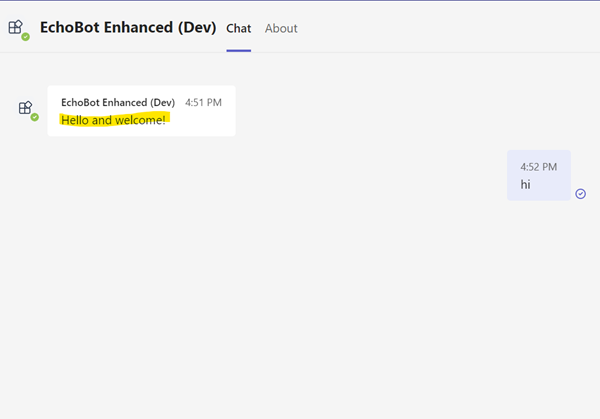
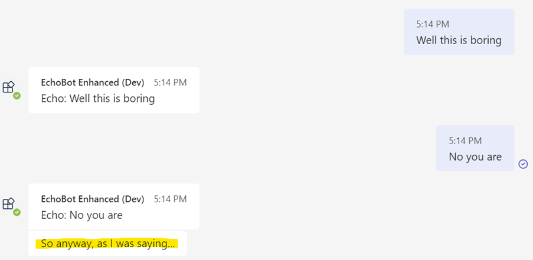
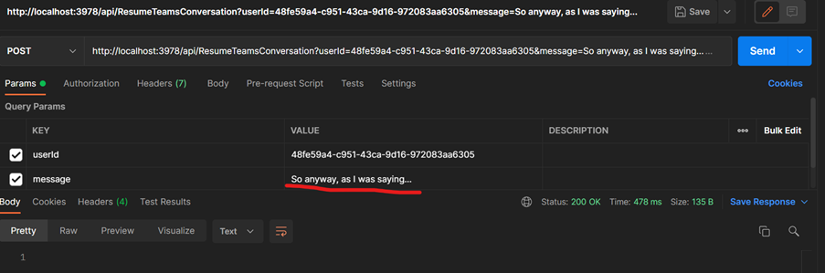
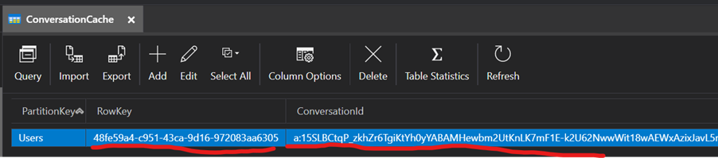

# Proactive Bot Greetings with Enhanced EchoBot
When you start a new conversation with a bot, a new conversation is started, and members are added. You can trap this even with Bot Framework like so:

```C#
protected override async Task OnMembersAddedAsync(IList<ChannelAccount> membersAdded, ITurnContext<IConversationUpdateActivity> turnContext, CancellationToken cancellationToken)
{
    var welcomeText = "Hello and welcome!";
    foreach (var member in membersAdded)
    {
        if (member.Id != turnContext.Activity.Recipient.Id)
        {
            // Say hi
            await turnContext.SendActivityAsync(MessageFactory.Text(welcomeText, welcomeText), cancellationToken);
        }
    }
}
```

…and it looks like this:



The bot notices a new conversation and proactively introduces itself.
The problem is that in Teams, this new conversation event only happens once per person, ever. The bot doesn’t get any new “conversation started” event for that same person again, just new conversations with new people.

After that we’re just returning to the same conversation and resuming the previous thread.

However, it is possible for the bot to also resume the conversation, assuming it has a reference to the previous conversation in some cache or other:



That 2nd line from the bot is our own code again proactively saying something. This we do with our own API call:



And the code has the previous thread cached:



The "RowKey" is the user Azure AD ID for the person talking to the bot, btw. 

No special permissions are needed; just a conversation reference ID for that user so we can execute this:

```C#
// Ping an update using previous conversation reference (cached conversation ID)
await ((BotAdapter)_adapter).ContinueConversationAsync(_config.MicrosoftAppId, previousConversationReference,
    async (turnContext, cancellationToken)
        => await turnContext.SendActivityAsync(message, cancellationToken: cancellationToken), cancellationToken);
```

This isn’t as clean as the “new conversation/members-added” event, but it is something at least. In this demo we trigger it from a HTTP call, which could be called from a Flow/Logic app or something.

# Setup
Create a new Azure Bot service (Multi Tenant) in an Azure subscription that shares the same AAD as Teams. Also create a storage account for the conversation cache.
In the app registration you'll need to copy out the client secret & ID - create a new secret if you have to. 

Create an appsettings.json or secrets file with this configuration:

```json
{
  "MicrosoftAppTenantId": "",
  "MicrosoftAppId": "",
  "MicrosoftAppPassword": "",
  "Storage": "DefaultEndpointsProtocol=https;AccountName=xxxx;AccountKey=xxxxx;EndpointSuffix=core.windows.net"
}
```
