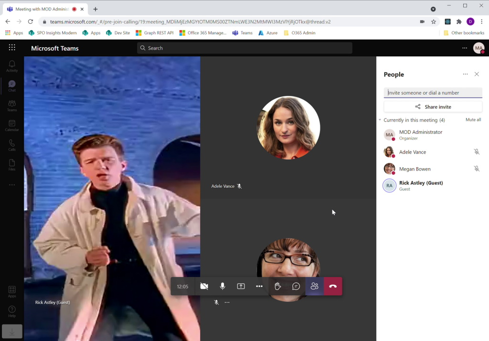

# RickrollBot Setup Guide
RickrollBot is a "Real-time Media Platform" Teams bot that is designed to Rickroll Teams meetings. In laymans terms it's a bot that can send/receive audio & video in Teams (or other platforms too).

The purpose of RickrollBot is two-fold: a research project to experiment with especially for people interested in these types of bots, and for the lulz too.



It's designed to run either locally via ngrok (usually), or in Azure Kubernetes Service so it can scale for "production" scenarios. 

It's not trivial to get running mainly thanks to the fact that these types of bots require TCP-level integration into the host OS. This means they won't work inside the usual context of IIS or any other webserver which would handle a lot of the hassle around SSL and TCP. But this guide should get you there regardless, if you have some patience. It's all in a good cause though: Rick Astley in your Teams meetings. 

# Infrastructure
For this to work, we need one domain for signalling and TCP streaming.

Example domain: **teamsplatforms.net**
SSL (wildcard): *.teamsplatforms.net

# Common Requirements
To pull off epic Rickrolls you need:

1. Azure subscription on same Azure tenant as Office 365/Teams
2. Source code: [https://github.com/sambetts/poc-bots/tree/main/RickrollBot](https://github.com/sambetts/poc-bots/tree/main/RickrollBot)
3. Bot permissions in Azure AD application:
    - AccessMedia.All
    - JoinGroupCall.All
    - JoinGroupCallAsGuest.All

# Common Azure Resources Setup
These steps apply to both dev and production deployments.

## Create Azure Bot Service
1. Create new "Azure bot" in the Azure portal (can use az cmd if you wish too). 
    - Use the free tier. 
    - Type of app: "single tenant" or "multi tenant" (just not 'managed identity' - important).
    - Create a new application registration for bot service.
    - Once created, configure channel to Microsoft Teams, with calling enabled with endpoint: https://$botDomain/api/calling
2. Take note of associated bot service app registration ID &amp; secret – the secret of which is stored in an associated key vault in the same resource-group.
    - You'll have to add yourself to the access control of the key vault to get the secret. 

## Grant Bot Teams Access
The bot app registration needs the rights to join meetings next. In "API permissions" add the Graph API permissions granted specified in the requirements.
**Important**: don't forget to grant admin consent to these permissions. 

---

# Development Setup

This section covers everything needed to run the bot locally from Visual Studio using ngrok for tunnelling.

## Dev Requirements
- ngrok with pro licence already configured (pro version needed to allow TCP + HTTP tunnelling).
    - OR: a public IP address on your VM. 
- Free SSL certificate for ngrok/dev URL (see below on how to generate). Self-signed SSL will not work. 
- Visual Studio 2022/2026

## Dev Infrastructure
Local dev is a slightly complicated one because to reverse-proxy TCP and HTTP, we have two different domains by design. 
We also need an SSL certificate for the TCP domain, which we can't do directly for the TCP domain NGrok gives us, so we need a CNAME to redirect it.

NGrok TCP tunnel: tcp://1.tcp.ngrok.io:26065 -> localhost:8445

DNS:
* ngrok domain: rickrollbot.ngrok.io
* CNAMEs: 
  * ngrok.teamsplatforms.net -> rickrollbot.ngrok.io
  * remotemediadev.teamsplatforms.net -> 1.tcp.ngrok.io

Media URL for bot: remotemediadev.teamsplatforms.net
Signalling: rickrollbot.ngrok.io

Both use same SSL certificate. More details: https://microsoftgraph.github.io/microsoft-graph-comms-samples/docs/articles/Testing.html

## Dev Configuration Reference
- An ngrok domain, TCP tunnel address, and auth token for pro license - $ngrokAuthToken.
- SSL certificate thumbprint - $certThumbPrint.
- Bot service DNS name (your reserved NGrok domain) - $botDomain.
- Azure AD: tenant ID, Bot App ID &amp; secret - $azureAdTenantId, $applicationId, $applicationSecret.
- Azure Bot Service name – $botName.

## Step 1: Prepare Local Files
Copy 'BotService\Bot.Console\template.env' to just 'BotService\Bot.Console\\.env'.
- If Windows explorer doesn't like the rename, you may need to run: copy .\template.env ".\\.env"

## Step 2: Setup ngrok Tunnelling
For developer machines you'll want to run the bot directly from Visual Studio instead of from a container. For this to happen, we need inbound tunnelling to the right places.

1. In [https://dashboard.ngrok.com/](https://dashboard.ngrok.com/), reserve a TCP address &amp; domain, all based in the US region.
    - Reserved TCP address for the Skype Media endpoint. Take note of address ($streamingAddressFull) and also just the port of the TCP address ($streamingAddressPort).
    - A new ngrok forwarding domain for the Azure bot service - $botDomain.
    - Important: for some reason (that's not entirely clear to me) [if your reserved TCP port is something other than 0.tcp.ngrok.io or 1.tcp.ngrok.io, the bot will not connect.](https://github.com/microsoftgraph/microsoft-graph-comms-samples/issues/405#issuecomment-787608319)

2. Copy 'ngrok-bot-tunnels - template.yaml' to 'ngrok-bot-tunnels.yaml'. Update:
    - $ngrokAuthToken
    - $streamingAddressFull (TCP address with port)

3. Run ngrok to open tunnels like so: "ngrok start --all --config .\ngrok-bot-tunnels.yaml"

The ngrok output should look something like this:

    - Region United States
    - tcp://1.tcp.ngrok.io:26065 -> localhost:8445
    - https://rickrollbot.ngrok.io -> http://localhost:9441

## Step 3: Generate SSL for Bot Media TCP Endpoint
As this bot receives audio/video streams it must expose a TCP endpoint with SSL in addition to the normal HTTP endpoints. For dev we must request these certificates manually; in production there is an AKS service we deploy to do it automatically.

1. Generate an SSL certificate for your developer ngrok addresses as per [this guide](https://github.com/microsoftgraph/microsoft-graph-comms-samples/blob/master/Samples/V1.0Samples/AksSamples/teams-recording-bot/docs/setup/certificate.md#%23generate-ssl-certificate).
    - In short, you need to use [Certify The Web](https://certifytheweb.com/) to generate SSL certificates via LetsEncrypt (an org that give free SSL cerificates out. Perfect for us).
    - Let's prove we "own" the ngrok domain. Open port 80 of your bot domain with a specific ngrok command (don't use your normal ngrok config file launch):
        - ngrok http 80  --subdomain $botDomain --scheme http 
        - Example: 'ngrok http 80 --subdomain rickrollbot --region us --scheme http' (example domain is: rickrollbot.ngrok.io)
    - Now run Certify The Web to validate you own the domain with ngrok running. Follow the UI instructions to generate the certificate. You should see a success message in Certify The Web if validation works. If it doesn't work, check your ngrok config and make sure port 80 is open and forwarding to the right place
2. The certificate will be installed to your local machine certificate store. Export the certificate with private key as a PFX file and take note of the thumbprint – $certThumbPrint.

## Step 4: Create netsh HTTP and SSL Bindings
Because we're hosting this bot outside of IIS, we need to do some once-only configuration to create SSL bindings.
In "RickrollBot\build" copy "certs-dev-template.bat" to "certs-dev.bat". 

Edit the bat file, *replacing* the following placeholder values:
- `<CALL_SIGNALING_PORT>` – from `AzureSettings__CallSignalingPort` in `.env`
- `<INSTANCE_INTERNAL_PORT>` – from `AzureSettings__InstanceInternalPort` in `.env`
- `<CERTIFICATE_THUMBPRINT>` – from `AzureSettings__CertificateThumbprint` in `.env`
- `AppId` is pre-filled from `BotService\Bot.Console\Properties\AssemblyInfo.cs` – verify it matches your `[assembly: Guid("...")]` value

Run "certs-dev.bat" with admin priveledges and check output for errors. The first time you run you'll see errors deleting old bindings. 

## Step 5: Configure and Run from Visual Studio

1. Open "RickrollBot\BotService\Bot.Console\.env" and update the following values.
    - AzureSettings\_\_BotName - $botName
    - AzureSettings\_\_AadAppId - $applicationId
    - AzureSettings\_\_AadTenantId - $azureAdTenantId
    - AzureSettings\_\_AadAppSecret - $applicationSecret
    - AzureSettings\_\_ServiceDnsName - $botDomain
    - AzureSettings\_\_CertificateThumbprint - $certThumbPrint
    - AzureSettings\_\_InstancePublicPort - $streamingAddressPort

2. Run Visual Studio as administrator and start debugging 'Bot.Console'.
    - Set Bot.Console as the start-up project.

## Alternative Dev Approach: Direct Networking to VM
If for some reason ngrok just isn't working out for you, you can just directly pipe traffic into your virtual machine. It just needs a public endpoint of some kind - a public IP address for example. I wouldn't recommend doing this unless ngrok just doesn't work out because you lose the logging facilities of ngrok, and it's less secure. Here's how anyway.

- Open ports 80, 8445, 9441, 9442 on incoming firewall(s).
- Create DNS for VM - $alternativeDevDNS.
- Generate new SSL certificate for endpoint.
    - Update ".env" file:
        - New certificate thumbprint.
        - Use port 8445 for InstancePublicPort and InstanceInternalPort.
- Update & re-run the certs-dev.bat file to re-bind endpoints in Windows.

Test no SSL error: open https://$alternativeDevDNS:9441/ (404 is expected). This address is where you'll send your bot POST commands to. 

## Dev Testing
Once the bot service is running we should test if it's working.

First networking. We assume there are no firewalls interfering with the service endpoints:
- https://$botDomain (default SSL port 443) - used for Teams signals & our own bot control API.
- $streamingAddressPort

Test localhost from browser (https://localhost:9441/). You should get a 404. 

Test ngrok URL - https://$botDomain (e.g https://rickrollbot.ngrok.io). You should also see a 404.

Next let's check if the bot can join a Teams call.
    POST to https://rickrollbot.ngrok.io/joinCall
```json

    {
        "JoinURL": $teamsJoinUrl,
        "DisplayName": "Rick Astley"
    }
```

Example body:
```json
    {
        "JoinURL": "https://teams.microsoft.com/l/meetup-join/19%3ameeting_NTMyM2M4YTYtY2ZiMi00NjkxLWI1YzQtZDA4MzJjM2E4NWFm%40thread.v2/0?context=%7b%22Tid%22%3a%22ffcdb539-892e-4eef-94f6-0d9851c479ba%22%2c%22Oid%22%3a%2248fe59a4-c951-43ca-9d16-972083aa6305%22%7d",
        "DisplayName": "Rick Astley"
    }
```

And with that, Rick should join your Teams call.

---

# Production Setup

This section covers everything needed to deploy the bot to Azure Kubernetes Service (AKS) for scalable production use.

## Production Requirements
- Public bot domain (root-level) + DNS control for domain.
- Docker for Windows to build bot container image.

## Production Configuration Reference
- Bot service DNS name (your own domain) - $botDomain.
- Azure container registry name/URL - $acrName (for 'contosoacr').
- Azure App Service to host Teams App; the DNS hostname - $teamsAppDNS.
- Application Insights instrumentation key - $appInsightsKey.
- Azure AD: tenant ID, Bot App ID &amp; secret - $azureAdTenantId, $applicationId, $applicationSecret.
- Azure Bot Service name – $botName.

## Step 1: Prepare Local Files
- Copy 'deploy\cluster-issuer - template.yaml' to 'deploy\cluster-issuer.yaml'
- Edit 'cluster-issuer.yaml' and replace '$YOUR\_EMAIL\_HERE' with your own email.
    - This is used for LetsEncrypt and needs to be a proper email address; not a free one (Gmail, Outlook, etc)

## Step 2: Build & Publish Docker Image
For AKS deployments we first need an image of the bot service.

1. Create an Azure container registry to push/pull bot image to. Basic tier is fine.
2. With Docker in 'Windows container' mode, build a bot image from the root directory.
    - docker build -f ./build/Dockerfile . -t [TAG]
        - [TAG] is the FQDN of you container registry + image name, e.g. 'rickrollbot.azurecr.io/rickrollbot:1' 
3. Push image to container registry with 'docker push'. Take note of version tag (e.g 'rickrollbot.azurecr.io/rickrollbot:1' – this number/value is your $containerTag).
    - You may need to authenticate to your ACR first with 'az acr login --name $acrName'

Get your IP address and DNS setup while the image is downloading and building. DNS needs to be working before we deploy anything in AKS. 

## Step 3: Create AKS Resource via PowerShell
For production we'll run the bot in AKS so it can scale up & down. This script creates a whole architecture in Kubernetes: a reverse nginx proxy + load-balancer + a scale-set role for the bot image + an SSL certificate manager to get & renew your public SSL certificate (like we do manually for the dev environment).

Script pre-reqs:
- PowerShell script requires Azure CLI: https://docs.microsoft.com/en-us/cli/azure/
- helm - https://helm.sh/docs/intro/install/
- Login to az cmd with "az login" before running.

1. Create in Azure a public IP address (standard SKU) for bot domain & create/update DNS A-record. Resource-group can be the same as AKS resource. Remember the name you gave it for the next step.
2. Update your DNS for your $botDomain DNS records to point at your new IP address (new A-record).
2. From 'ickrollBot\deploy' run 'deploy\setup.ps1' to create AKS + bot architecture, with parameters:
    - $azureLocation – example: 'westeurope'
    - $resourceGroupName – example: 'RickrollBotProd'
    - $publicIpName – example: 'AksIpStandard'
    - $botDomain – example: 'rickrollbot.teamsplatform.app'
    - $acrName – example: 'rickrollbot'
    - $AKSClusterName– example: 'RickrollAKS'
    - $applicationId – example: '151d9460-b018-4904-8f81-14203ac3cb4f'
    - $applicationSecret – example: '9p96lolQJSD~\*\*\*\*\*\*\*\*\*\*\*\*' (example truncated)
    - $botName – example: 'RickrollBotProd'
    - $containerTag – example: '1' (for 'rickrollbot.azurecr.io/rickrollbot:1')
    - $applicationInsightsKey - an Application Insights instrumentation key

If the script fails for some reason, you can just run it again. It'll create & configure AKS, move the IP address to the AKS resource-group if needed, and create the archtecture mentioned above using helm templates. 

## Step 4: Verify K8 Deployment
Check the bot pods (i.e the containers running Rickroll bot) are creating and your image is being pulled without any error:
- kubectl get pods -n rickrollbot

    NAME            READY   STATUS              RESTARTS   AGE
    rickrollbot-0   0/1     ContainerCreating   0          16m
    rickrollbot-1   0/1     ContainerCreating   0          16m
    rickrollbot-2   0/1     ContainerCreating   0          16m

Status of the pods should eventually say "Running" with 0 restarts. It might take upto an hour to pull the image though. 

**Check the load-balancer has the right IP address assigned:**
- kubectl get svc -n ingress-nginx

It should show:

    NAME                                     TYPE           CLUSTER-IP     EXTERNAL-IP      PORT(S)                                                                      AGE
    nginx-ingress-ingress-nginx-controller   LoadBalancer   10.0.101.115   20.103.XXX.XXX   80:32215/TCP,443:30505/TCP,28550:32010/TCP,28551:32552/TCP,28552:31180/TCP   9h

**Check the TLS service is rununing:**
- kubectl get cert -n rickrollbot

It should show:

    NAME          READY   SECRET        AGE
    ingress-tls   True    ingress-tls   1h

Something not right? Check events with:
- kubectl get events --all-namespaces

## Reconfigure / Redeploy Service
If you need to redeploy just the bot image or reconfigure it, you can do so without completely redeploying everything with this:

    helm upgrade rickrollbot ./rickrollbot --namespace rickrollbot --set host=rickrollbot.teamsplatform.app --set public.ip=20.103.XXX.XXX --set image.domain="rickrollbot.azurecr.io" --set image.tag=1 --set scale.replicaCount=1

If you've upgrade the bot solution; push a new tag to the container registry and apply the new tag with this command. K8 will do the rest!

## Production Testing
Once deployed, verify the service endpoints are accessible (assume no firewalls interfering):
- https://$botDomain (default SSL port 443) - used for Teams signals & our own bot control API.
- $streamingAddressPort

Next let's check if the bot can join a Teams call.
    POST to https://$botDomain/joinCall
```json

    {
        "JoinURL": $teamsJoinUrl,
        "DisplayName": "Rick Astley"
    }
```

Example body:
```json
    {
        "JoinURL": "https://teams.microsoft.com/l/meetup-join/19%3ameeting_NTMyM2M4YTYtY2ZiMi00NjkxLWI1YzQtZDA4MzJjM2E4NWFm%40thread.v2/0?context=%7b%22Tid%22%3a%22ffcdb539-892e-4eef-94f6-0d9851c479ba%22%2c%22Oid%22%3a%2248fe59a4-c951-43ca-9d16-972083aa6305%22%7d",
        "DisplayName": "Rick Astley"
    }
```

And with that, Rick should join your Teams call.

# Troubleshooting
Test access to TCP ports:

    Test-NetConnection -ComputerName $botDomain -Port InstancePublicPort

You should see:

    TcpTestSucceeded : True

**Dev only:** Review Teams control message logs with the ngrok local web UI: http://127.0.0.1:4040

Review Visual Studio output/App Insights Telemetry. Here's a working dev bot start-up log (using ngrok):

    Initializing MP with Service FQDN: rickrollbot.ngrok.io, Instance public port: 26065, Instance internal port: 8445
    UseMPAzureAppHostPerfCounterProvider is false. Discarding MP perf counters
    erf is not registered: no key found at SYSTEM\CurrentControlSet\Services\MediaPerf\Performance
    UseMPAzureAppHostPerfCounterProvider is false. Not checking for perf counter registration
    MP Service Event: ReportEvent_MPSVC_I_SERVICE_STARTING
    00001 (MPSERVICEHOSTLIB,.ctor:MPInstanceDescriptor.cs(158)) [MPBindingConfig] SecurityKeys are Issuer: CN=R3, O=Let's Encrypt, C=US  CertSN: 036CC5B81C0D71B483E5F80C6C351B0DBFD5
    2 (MPSERVICEHOSTLIB,.ctor:MPInstanceDescriptor.cs(161)) [MPBindingConfig] PrincipalName (localhost) is irrelevant in MTLS scenarios and will be ignored. Using certificate with SN: 036CC5B81C0D71B483E5F80C6C351B0DBFD5,  Issuer: CN=R3, O=Let's Encrypt, C=US
    00001 (AVMP,.cctor:MediaProcessor.cs(484)) [MP] MediaProcessor Service is created.
    [DevBox]3416.1::01/23/2022-07:55:16.914.00000002 (AVMP,InitializeHostMonitor:MediaProcessor.cs(1751)) [MP] InitializeHostMonitor: Set supportunencryptedaudioportrange to false!
    [DevBox]3416.1::01/23/2022-07:55:16.917.00000003 (AVMP,InitializeHostMonitor:MediaProcessor.cs(1751)) [MP] InitializeHostMonitor: Set UseBundledPortRangeForConsumer to false!
    [DevBox]3416.1::01/23/2022-07:55:16.920.00000004 (AVMP,InitializeHostMonitor:MediaProcessor.cs(1751)) [MP] InitializeHostMonitor: Set UseBundledPortRangeForBusiness to false!
    [DevBox]3416.1::01/23/2022-07:55:16.923.00000005 (AVMP,InitializeHostMonitor:MediaProcessor.cs(1767)) [MP] InitializeHostMonitor: Set bundledminportrange to false!
    [DevBox]3416.1::01/23/2022-07:55:16.925.00000006 (AVMP,InitializeHostMonitor:MediaProcessor.cs(1767)) [MP] InitializeHostMonitor: Set bundledmaxportrange to false!
    [DevBox]3416.1::01/23/2022-07:55:18.245.00000003 (MPSERVICEHOSTLIB,EndInitialize:MPHostImpl.cs(777)) [MPServiceHost] EndInitialize - Blocking
    MP Service Event: ReportEvent_MPSVC_I_SERVICE_STARTED
    Initialized MP With TCP Uri: [net.tcp://rickrollbot.ngrok.io:26065/MediaProcessor] and HTTP Uri: []
    [DevBox]3416.1::01/23/2022-07:55:18.290.00000007 (AVMP,OnPublicRtpIPAddressChanged:MediaProcessor.cs(737)) MediaProcessor.OnPublicRtpIPAddressChanged, Interpreting Public Address [0.0.0.0] as 'not configured'
    [DevBox]3416.1::01/23/2022-07:55:18.298.00000008 (AVMP,OnPublicRtpIPAddressChanged:MediaProcessor.cs(766)) MediaProcessor.OnPublicRtpIPAddressChanged, Configuring public Addresses failed due to invalid or missing mappings
    Set PIP on MP: [0.0.0.0]
    MP workload configuration set to [(500,500)]
    Initialized MediaApi Platform
    Initialized MediaPlatform. ApplicationId : 20923ad3-db6b-4488-ad4d-d0d17232197d, MPUri: net.tcp://rickrollbot.ngrok.io:26065/MediaProcessor, IsTest: False.
